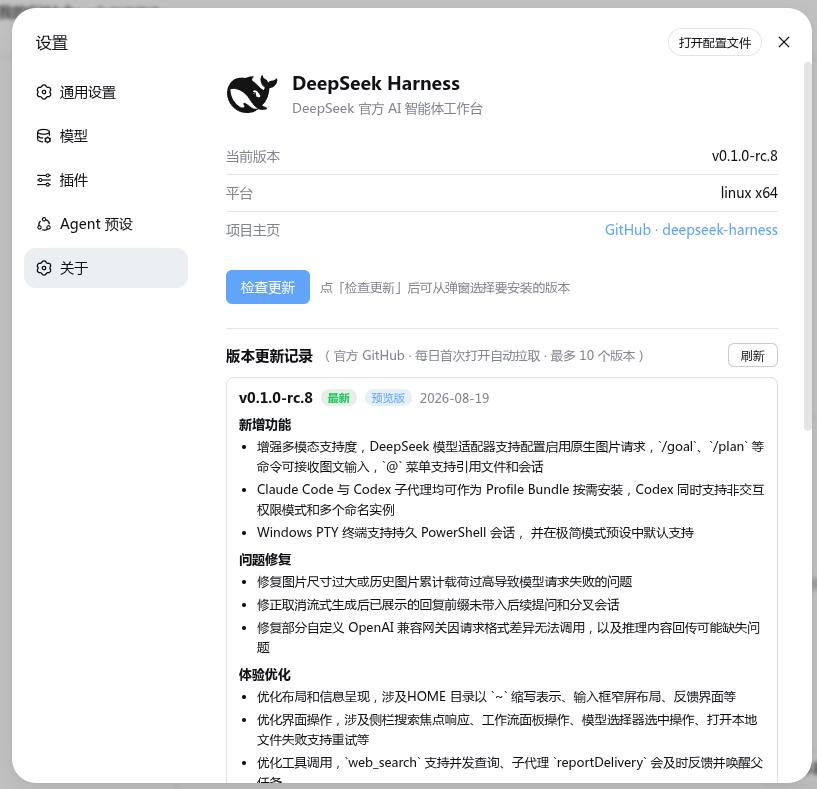

# dsh-about

DeepSeek Harness 设置中心「关于」分区插件 —— **检查更新 + 一键更新**。

> DeepSeek Harness 设置中心“About” tab: DeepSeek logo, version info, **check for updates** (npm `latest`/`next`), one-click update with auto-restart, and GitHub releases history.



## 功能特性

- **版本信息**：当前 dsh 版本（npm 包 `@deepseek-ai/dsh`）、Web 前端版本、Node / 平台、项目主页。
- **检查更新**：对比当前版本与 npm `latest` / `next` 两个 dist-tag 中较新者，提示发现新版本。
- **版本选择**：列出 npm 上所有比当前新的版本（最多 10 个），弹窗选择安装。
- **一键更新**：`npm install -g @deepseek-ai/dsh@<目标版本>`（固定官方 registry），成功后**自动重启 dsh web**（独立看护进程等待宿主退出后按原命令重新拉起，含启动即崩重试）。
- **版本更新记录**：官方 GitHub Releases 最新 10 条，中文正文渲染，每日首次打开自动拉取一次。

## 安全性设计要点

- 宿主路由 `/dsh-about/*` **仅允许回环地址**访问（DNS 重绑定防护），跨站 GET 用 `Sec-Fetch-Site` 拦下，跨站 POST 用 `Origin` 白名单 + `application/json` 预检双重防护（CSRF）。
- `/update` 是破坏性端点：并发互斥（同一时刻只允许一个安装任务）、目标版本号必须**已存在于 npm 注册表**且比当前新。
- `npm install -g` 带 5 分钟超时与进程组终止，安装输出尾部回显到弹窗便于排查。
- 只有加载了本插件的 dsh 进程才获得这些能力；不修改任何核心文件，卸载即完全移除。

## 安装

把你的 AI 指到本仓库，一句话即可：

> 把 https://github.com/YannZhou/dsh-about 这个 dsh 插件装到 DeepSeek Harness 的 web profile 里。请按仓库里的 AI-INSTALL.md 执行。

手动安装：

```sh
git clone https://github.com/YannZhou/dsh-about.git
dsh plugin --profile web add ./dsh-about        # 在 dsh-about 的父目录执行；也可用绝对路径
dsh --profile web --dump-config | grep dsh-about   # 应看到 - id: dsh-about 层
```

然后重启 / 刷新 `dsh web`（默认 http://127.0.0.1:3080），打开 **设置 → 关于** 即可看到本分区。

## 验证

- 配置树中应出现 `- id: dsh-about / name: dsh-about` 层（bundle 自动应用）。
- 浏览器侧：设置 → 关于出现 DeepSeek 图标与版本行；点「检查更新」返回 npm 最新版本对比结果。

## 卸载

```sh
dsh plugin --profile web remove dsh-about
```

移除后插件行、依赖与浏览器侧组件一并消失，不残留。

## 架构简介

双半体插件，两个文件，零构建：

| 文件 | 半体 | 职责 |
|---|---|---|
| `lib/index.js` | 宿主（Cordis loader 行） | 注册 `/dsh-about/{describe,releases,check,versions,update}` 同源 HTTP 路由；npm dist-tag / packument / GitHub Releases 拉取；`npm install -g` 执行与自动重启看护 |
| `lib/client.js` | 浏览器（`window.__ModuleLoader__` 模块） | 注册 `settings.section`（id: `about`，导航「关于」）组件：图标、版本行、检查更新/一键更新弹窗、版本更新记录（localStorage 日缓存） |

- 宿主行由 `cordis.patch.yml`（`dsh.bundle.patch`）挂载；浏览器半体由包内 `dsh.client` 清单 + `exports["./client"]` 自动发现打包（`@deepseek-ai/dsh-client-modules` 机制）。
- **零运行时依赖**：semver 已内嵌（`lib/semver.js`，语义与 node-semver 对齐并通过全量对拍）。`dsh plugin add <目录>` 走 `link:` 协议时不携带外部依赖，因此 clone 即可装、即装即用。

## 兼容性

- dsh CLI ≥ 0.x（支持 `dsh plugin --profile <name> add/remove` 与 `cordis.patch.yml` insert 层）。

## License

MIT © YannZhou