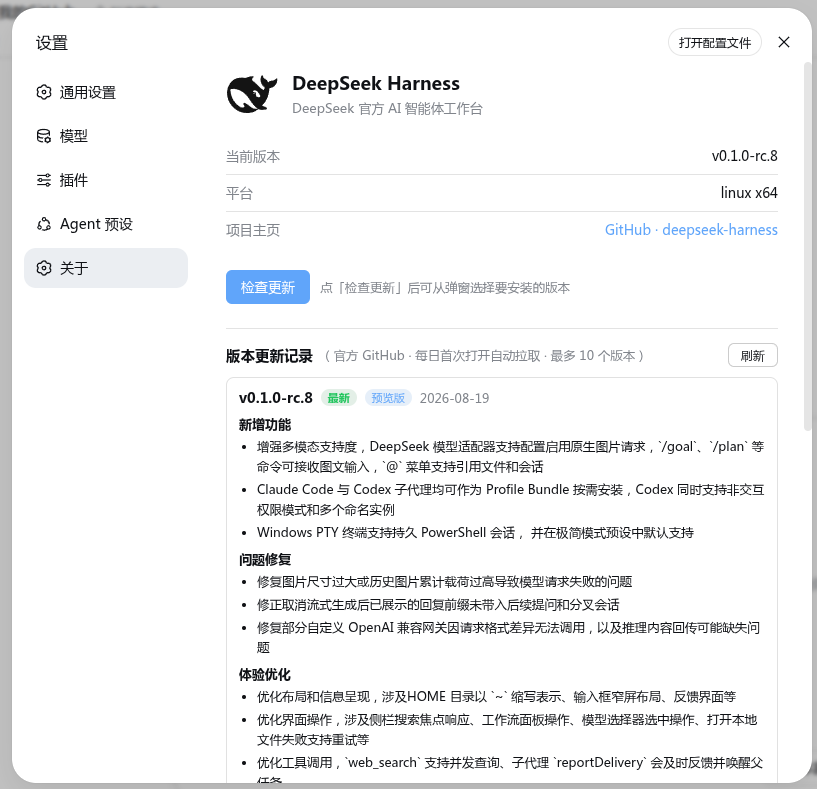

# dsh-about

作者：[@YannZhou](https://github.com/YannZhou)

DeepSeek Harness 设置中心「关于」分区插件：查看版本、检查更新、一键更新、看版本更新记录；也能看到**本插件自己的版本**并在有新版时一键更新它。



## 功能

- **版本信息**：当前 dsh 版本、Web 前端、Node 版本与平台信息，一目了然。
- **检查更新**：自动对比官方最新版和预发布版，带分级提示，不盲目推荐。
- **一键更新**：选定更新源直接安装，装完自动重启 dsh web；Windows / macOS / Linux 都能用，无常驻进程。
- **更新源切换**：官方源 / 国内镜像 / 跟随本地配置，下拉即切，点击即可实测延迟。
- **版本更新记录**：官方发布的最新 10 条记录，中文显示，默认收起，每天自动拉取并缓存到本地。匿名调用 GitHub 受 60 次/小时（按出口 IP）限制、共享出口容易被打满而报「拉取失败」——「关于」面板可配置 GitHub token（含测试连接与配额回显），配置后按账号计 5000 次/小时，未配置时行为与从前完全一致。
- **发布同步检测**：代码已发布而 npm 还没跟上时明确提示，npm 发布后提示自动消失。
- **插件自身版本与自更新**：显示 dsh-about 当前版本；npm 上有新版时，版本号旁与「关于」导航项右上角出现小红点，点版本号即可一键更新插件（走 `dsh plugin add`，装完自动重启）。**更新 DSH 前会提醒先更新插件**——新版 DSH 下旧插件可能失效，届时就没法再发起更新了。
- **更新结果可信**：安装时的重启完成判定同时校验**进程身份**（每进程随机 nonce），不会被「已装好新版但还没退出的旧进程」冒充；自动重启未能布防时面板会立刻说清楚原因，不让用户干等。
- **升级期白屏自救**：升级时前端资源会被就地替换，正在运行的旧宿主可能因此拿不到旧版文件而把页面搞崩。插件自带一个安装期守卫，页面一旦崩成空白就等服务端重新可答后自动刷新，**不会停在永久白屏**（根治需宿主侧配合，此处为兜底）。
- **本地源码安装的保护**：若插件是 `link:` / `file:` 方式装的（开发态），自更新会拒绝执行并说明原因，不会把你的源码目录替换成 npm 包。

## 安装

前提：已安装 DeepSeek Harness（`npm i -g @deepseek-ai/dsh`，Node ≥ 18）。

> [!IMPORTANT]
> **npm ≥ 12 用户注意**：npm 12 默认拦截依赖的安装脚本。dsh 带有原生模块
> （fs-ext、koffi、node-pty 等），被拦截会缺编译产物，装完 dsh 打不开
> （报 `Cannot find module '.../build/Release/fs_ext.node'`）。放行用 npm **官方**的
> `allow-scripts` 机制。
>
> ⚠️ **不要再用 `--dangerously-allow-all-scripts`**：npm 已公告移除该开关，
> 而给 npm 传它不认识的旗标会**直接报错退出**（`EUNKNOWNCONFIG`），不是忽略。
>
> 一次性写进用户配置（推荐，之后手动升级都安全）：
> ```sh
> npm config set allow-scripts=fs-ext,koffi,node-pty,protobufjs,@google/genai,@deepseek-ai/dsh-subprocess-local --location=user
> npm install -g @deepseek-ai/dsh@latest
> ```
> 只想放行这一次：
> ```sh
> npm install -g --allow-scripts=fs-ext,koffi,node-pty,protobufjs,@google/genai,@deepseek-ai/dsh-subprocess-local @deepseek-ai/dsh@latest
> ```
> 本插件「一键更新」已内置同样处理（官方 `--allow-scripts` + 安装后自动校验、不健康自动重装），
> 直接用即可，无需手动。插件每次启动还会扫描 dsh 实际依赖树，把其中的原生模块
> 以白名单形式追加进你的 `~/.npmrc`（只追加、不动其它配置，写前自动备份）——
> 手动执行 `npm install -g @deepseek-ai/dsh` 升级同样安全。
> 若 dsh 已经打不开：先按上面配好 `allow-scripts`，再 `--force` 重装当前版本即可修复。

> [!IMPORTANT]
> **最省事的装法：把仓库地址直接扔给你的 AI，让它帮你装。** 你只需要说一句"帮我装这个插件"。
> 想自己动手的话，下面二选一：

```sh
# 方式一：GitHub 安装
dsh plugin --profile web add "git+https://github.com/YannZhou/dsh-about.git"

# 方式二：npm 安装（已发布到 npm）
dsh plugin --profile web add @yannzhou/dsh-about
```

装完刷新 `dsh web`（默认 http://127.0.0.1:3080），打开 **设置 → 关于** 就能看到。

## 卸载

```sh
dsh plugin --profile web remove @yannzhou/dsh-about
```

> 改名前的旧安装请用裸名卸载：`dsh plugin --profile web remove dsh-about`。
> 运行期数据由卸载钩子自动清理，卸载后零残留；`link:`/本地路径/tarball 安装不触发钩子时补跑兜底脚本：POSIX 用 `bash scripts/uninstall.sh`，Windows 用 `node scripts/uninstall.mjs`（两者清理目标与安全判断一致，详见 [docs/INSTALL.md](./docs/INSTALL.md)「卸载」）。

## 更多文档

| 文档 | 内容 |
|---|---|
| [安装手册](docs/INSTALL.md) | 完整安装 / 验证 / 卸载 / 故障排查 |
| [架构说明](docs/ARCHITECTURE.md) | 架构简介与安全性设计 |
| [发布说明](docs/NPM-PUBLISH.md) | 发布到 npm（维护者向） |
| [版本文档](docs/versions/README.md) | 每个已发布版本的详细说明（Release 页正文只引导到这里） |
| [发布流程](RELEASE.md) | 版本发布规矩、Release 文案格式与发布前检查清单（维护者向） |

## License

MIT © YannZhou
